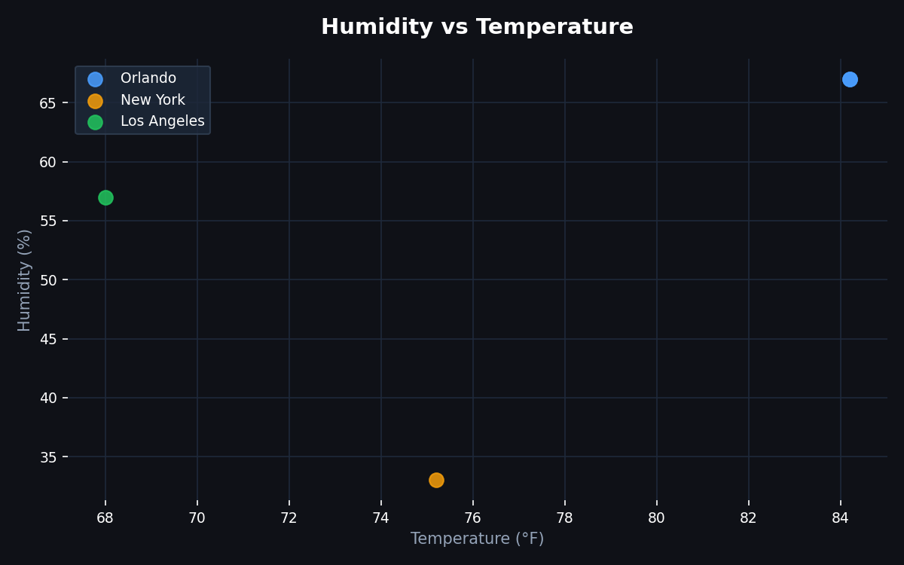

# 🌦️ Weather ETL Pipeline

A Python data engineering project that extracts live weather data from the [Weatherstack API](https://weatherstack.com), transforms it using **pandas**, and loads it into a **SQLite** database — following the industry-standard **ETL (Extract → Transform → Load)** pattern.

---

## 📌 What It Does

- **Extracts** current weather for any list of cities via REST API
- **Transforms** the raw JSON into a clean, flat structure with derived columns
- **Loads** each record into a local SQLite database (append mode — builds history over time)
- **Visualizes** trends with matplotlib — bar, line, and scatter charts
- **Reports** a formatted snapshot of the latest run in the terminal

---

## 🗂️ Directory Structure

```
weather-etl-pipeline/
│
├── pipeline.py          # Main ETL script — extract, transform, load, report
├── visualize.py         # Generates charts from the database
│
├── charts/              # Auto-generated by visualize.py
│   ├── bar_chart.png
│   ├── line_chart.png
│   └── scatter_chart.png
│
├── requirements.txt     # Python dependencies
├── .env.example         # API key template (copy to .env, never commit .env)
├── .gitignore           # Excludes .env, *.db, venv, pycache
└── README.md
```

---

## 🔄 Pipeline Architecture

```
┌─────────────────────┐     JSON      ┌──────────────────────┐      df       ┌────────────────────┐
│      EXTRACT        │ ───────────▶  │      TRANSFORM        │ ───────────▶ │        LOAD        │
│                     │               │                        │              │                    │
│  Weatherstack API   │               │  pandas DataFrame      │              │  SQLite            │
│  /current endpoint  │               │  • flatten JSON        │              │  weatherstack.db   │
│  params: city,      │               │  • derive temp_f       │              │  table:            │
│          access_key │               │  • derive feels_cold   │              │  weather_data      │
│                     │               │  • add pipeline_run    │              │                    │
└─────────────────────┘               └──────────────────────┘              └────────────────────┘
         ▲
         │  loops over CITIES list with 2s delay (rate limit)
         │
    run_pipeline()
```

---

## 🧠 How It Works

The pipeline is split into 4 clean functions, each with one job:

**1. `extract(city)`**
Sends an HTTP request to the Weatherstack API with the city name as a parameter. Gets back a JSON response — a raw nested dictionary full of weather data.

**2. `transform(raw)`**
Takes that messy dictionary and flattens it into a clean pandas DataFrame. Also creates new columns that weren't in the original data — like converting Celsius to Fahrenheit, flagging cold temperatures, and recording exactly when the pipeline ran.

**3. `load(df)`**
Takes the clean DataFrame and writes it to a SQLite database file (`weatherstack.db`). Uses `append` mode so every run adds new rows — building a history of weather data over time.

**4. `report()`**
Reads the latest run back out of the database and prints a formatted summary to the terminal so you can see what was loaded.

The `run_pipeline()` function ties all four together, loops over every city, and handles errors so one failed city doesn't stop the rest.

---

## 📦 Sample Data

What a single row looks like after it's been loaded into the database:

| city | country | temp_c | temp_f | humidity_pct | wind_kph | description | feels_cold | pipeline_run |
|---|---|---|---|---|---|---|---|---|
| Orlando | United States | 31 | 87.8 | 65 | 14 | Sunny | False | 2026-05-29 22:24:33 |
| New York | United States | 18 | 64.4 | 55 | 20 | Partly cloudy | False | 2026-05-29 22:24:35 |
| Los Angeles | United States | 22 | 71.6 | 60 | 10 | Clear | False | 2026-05-29 22:24:37 |

Each pipeline run appends new rows — the longer it runs, the more historical data you accumulate.

---

## 📊 Charts

Generated by running `python visualize.py`:




---

## 🛠️ How to Run

### Prerequisites
- Python 3.8+
- A free API key from [weatherstack.com](https://weatherstack.com)

### Setup

```bash
# 1. Clone the repo
git clone https://github.com/YOUR_USERNAME/weather-etl-pipeline.git
cd weather-etl-pipeline

# 2. Install dependencies
pip install -r requirements.txt

# 3. Create your .env file
cp .env.example .env
# Open .env and replace your_api_key_here with your real Weatherstack key

# 4. Run the pipeline
python pipeline.py

# 5. Generate charts
python visualize.py
```

### Customizing cities
Open `pipeline.py` and edit the `CITIES` list at the top:
```python
CITIES = ["Orlando", "New York", "Los Angeles", "Miami", "Chicago"]
```
Any city name recognized by Weatherstack will work.

---

## ⚙️ Tech Stack

| Tool | Purpose |
|---|---|
| Python 3.x | Core language |
| `requests` | HTTP calls to Weatherstack API |
| `pandas` | Data transformation and DataFrame management |
| `sqlite3` | Local database storage (built into Python) |
| `matplotlib` | Data visualization |
| `python-dotenv` | Secure API key management via `.env` |

---

## 📈 Derived Columns

Beyond the raw API fields, the transform step adds:

| Column | Logic |
|---|---|
| `temp_f` | Celsius → Fahrenheit conversion |
| `feels_cold` | `True` if temperature < 10°C |
| `high_wind` | `True` if wind speed > 40 kph |
| `pipeline_run` | UTC timestamp of when the row was loaded |

---

## 💡 What I Learned

- **ETL architecture** — how to separate extraction, transformation, and loading into distinct, reusable functions
- **REST APIs** — how to authenticate with an API key, pass query parameters, and parse JSON responses
- **pandas** — flattening nested JSON into DataFrames, creating derived columns, type conversions
- **SQLite** — connecting to a local database, writing DataFrames with `.to_sql()`
- **Error handling** — using `try/except` so individual failures don't crash the whole pipeline
- **API rate limiting** — why `time.sleep()` matters in production pipelines
- **Secure credential management** — storing API keys in `.env` files and never committing them to GitHub
- **Data visualization** — building bar, line, and scatter charts with matplotlib from live data

---

## 🚀 Future Improvements

- [ ] Schedule pipeline to run hourly automatically using the `schedule` library
- [ ] Add email or Slack alert when extreme weather is detected
- [ ] Export weekly summary report to CSV
- [ ] Migrate from SQLite to PostgreSQL for production-scale storage
- [ ] Deploy to AWS Lambda to run in the cloud on a timer
- [ ] Build a live dashboard with Streamlit
- [ ] Write unit tests for `transform()` using `pytest`

---

## 🔑 API

This project uses the free tier of [Weatherstack](https://weatherstack.com).
Free tier supports current weather only (no forecast or historical).
Rate limit: ~1 request/second — handled via `time.sleep(2)` in the pipeline.

---

## 👤 Author

**Tyler Estevez**
Aspiring Data Engineer | UCF Computer Science
[GitHub](https://github.com/TylerE05) | [LinkedIn](https://www.linkedin.com/in/tyler-estevez-4278b735a/)
